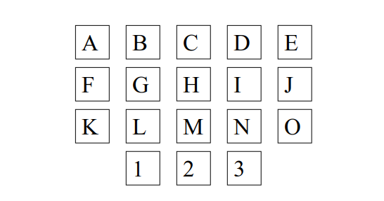
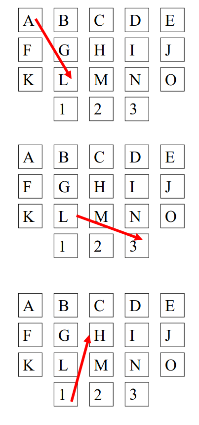

# KnightMove

_The Problem_

__Knight Sequences__

Pictured below is a keypad:

We want to find all 10-key sequences that can be keyed into the keypad in the following manner:

    • The initial keypress can be any of the keys.
    • Each subsequent keypress must be a knight move from the previous keypress.  
    • There can be at most 2 vowels in the sequence.

A knight move is made in one of the following ways:

    1. Move two steps horizontally and one step vertically.
    2. Move two steps vertically and one step horizontally.
    
There is no wrapping allowed on a knight move.

Below are some examples of knight moves:

Your program should first write the number of 
valid 10-key sequences on a single line to standard 
out.

_Discussion_

I assume wrap means no key appears twice in a 
sequence. Thus sequences like:

    1. CHMNIDCHMN, 
    2. CHMNIDCHML, 
    3. CHMLMN321L, or
    4. CHMLBGAFGL

are disallowed.

If that definition is two strict, it is a minor
change in the program.

  

